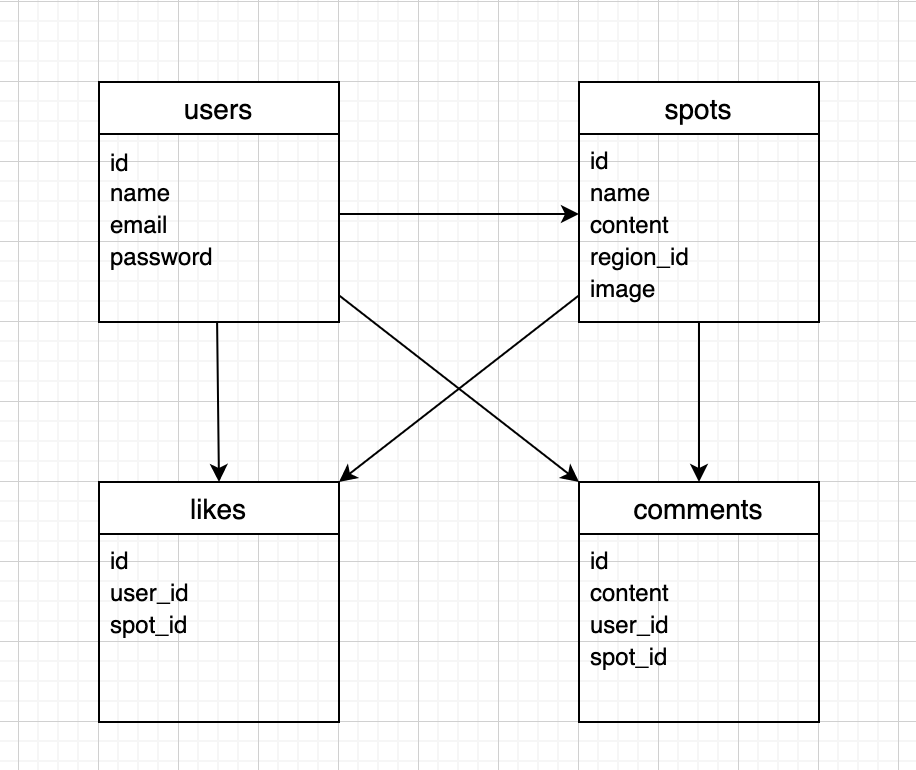

# README

## アプリケーション名
spot_app

## アプリケーション概要
踊れるスポットを検索、投稿できるアプリケーションです。

## アプリケーション作成背景
趣味のダンスができる場所を探したいときにレンタルスペースの検索サイトを利用していたのですが、それではダンスができる全ての場所を検索することができず、近くに非常に良い施設があることを知らずに過ごしていました。そういった背景があり、踊れる場所の検索に特化したサービスがあれば便利だと考えこのアプリケーションを作成しました。

## 機能一覧
* 検索機能(ransack)
* 投稿機能
  * 投稿の新規作成、詳細表示、編集、削除
  * 画像投稿(carrierwave、mini_magick)
* いいね機能
* コメント機能
* ユーザー管理機能(devise)
  * ユーザーの登録、詳細表示、編集、削除
  * ログイン、ログアウト

## 画面遷移図

## データベース設計

## テーブル設計

## usersテーブル
| Colum     | Type    | Options     |
| --------- | ------- | ----------- |
| name      | string  | null: false |
| email     | string  | null: false |
| password  | string  | null: false |

### Association
* has_many :spots
* has_many :likes
* has_many :comments

## spotsテーブル
| Colum     | Type    | Options     |
| --------- | ------- | ----------- |
| name      | string  | null: false |
| content   | text    | null: false |
| region_id | integer | null: false |
| image     | string  |             |

### Association
* has_many :likes
* has_many :comments
* belongs_to :user

## likesテーブル
| Colum     | Type    | Options     |
| --------- | ------- | ----------- |
| user_id   | bigint  |             |
| spot_id   | bigint  |             |

### Association
* belongs_to :user
* belongs_to :spot

## commentsテーブル
| Colum     | Type    | Options     |
| --------- | ------- | ----------- |
| content   | text    | null: false |
| user_id   | bigint  |             |
| spot_id   | bigint  |             |

### Association
* belongs_to :user
* belongs_to :spot

## 開発環境
Ruby / Ruby on Rails / JavaScript / jQuery / Bootstrap / MySQL / Github / AWS / Visual Studio Code
